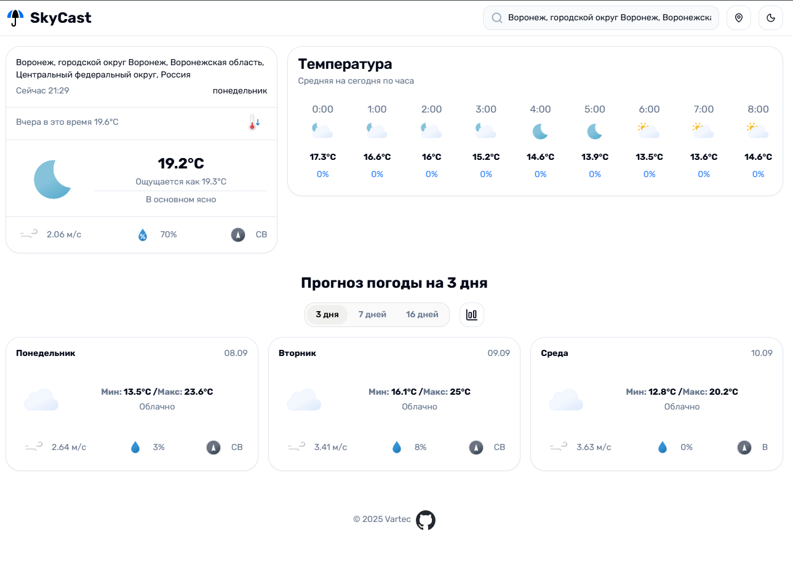

# SkyCast

SkyCast — лёгкое и аккуратное веб-приложение для получения прогноза погоды в реальном времени, покадрово (по часам) и на несколько дней вперед (до 16 дней). Приложение поддерживает PWA и оптимизировано для быстрой работы в браузере.

## Что делает

- Показывает текущую погоду для выбранного местоположения.
- Подробный почасовой прогноз.
- Прогноз по дням (до 16 дней).
- Поиск по населенным пунктам.
- Поддержка PWA: можно установить приложение на устройство.
- Лёгкий современный интерфейс с иконками и адаптивной вёрсткой.

## Технологии

- React + TypeScript
- shadcn/ui (компоненты пользовательского интерфейса)
- Open-Meteo — Weather Forecast API
- Vite (быстрая разработка и сборка)

## Быстрый старт (Windows, PowerShell)


1. Установите зависимости:

```powershell
npm install
```

1. Запустить в режиме разработки:

```powershell
npm run dev
```

1. Построить production‑версию:

```powershell
npm run build
```

1. Локально просмотреть production‑сборку:

```powershell
npm run preview
```

Примечание: проект содержит `bun.lock`. Если вы используете Bun, замените команды установки и запуска на соответствующие `bun` команды (например, `bun install`, `bun dev`).

## Структура проекта (кратко)

- `src/` — исходники приложения (компоненты, хуки, сервисы, типы).
- `public/` — статические активы (иконки, manifest, sw.js).
- `package.json`, `vite.config.ts` — конфигурация проекта и сборки.

## Конфигурация API

Проект использует Open‑Meteo. Конфигурация API и ключи, при необходимости, находятся в `src/config.ts` и соответствующих сервисах в `src/services/`.

## PWA

Файлы для PWA находятся в `public/` (`manifest.json`, `sw.js`, иконки). Приложение готово к установке в качестве PWA в поддерживаемых браузерах.

## Вклад и разработка

Если хотите помочь или предложить улучшения:

1. Создайте fork и ветку feature.
2. Откройте pull request с описанием изменений.

## Поддержка

Для вопросов и обратной связи: [Telegram](https://t.me/VartecCHS)


